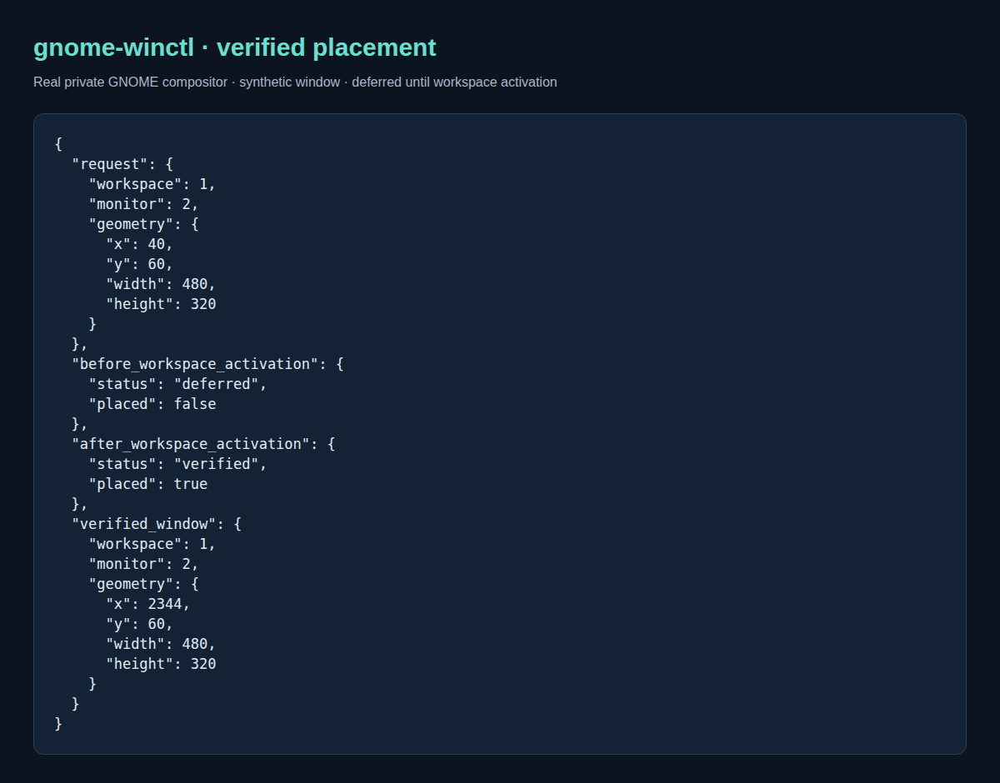

# gnome-winctl

Inspect, place and recover windows in native GNOME Wayland using a Shell extension
and Python CLI. Applications and session managers handle launching and contents.



Real disposable GNOME session with a synthetic window; [capture details](docs/usage.md#placement-capture).

## Setup and use

Requires GNOME Shell 46 on Wayland, Python 3.10+, `gdbus`, `gnome-extensions`,
and Node.js for tests.

```sh
make test  # Python/Node regression tests and JavaScript syntax checks
make install
gnome-extensions enable gnome-winctl-v3@sagecat.local
gnome-winctl status --json
gnome-winctl windows --json
# Replace 42 with an ID from the current window list.
gnome-winctl place 42 --workspace 1 --monitor 0 \
  --geometry 30,40,1200,800 --state normal --wait
```

Keep this checkout: the standalone installer links its CLI. Use the next normal
login if Shell has cached an older extension. Window IDs last only this Shell
session; indices start at zero. `--wait` requires verified placement.

## Documentation

- [Usage, request lifecycle, troubleshooting and capture reproduction](docs/usage.md)
- [Architecture and source map](docs/architecture.md) · [PlantUML source](docs/architecture.puml)
- [Placement and recovery reference](docs/reference.md) · [D-Bus contract](dbus/org.sagecat.GnomeWinCtl1.xml)
- [Releases](https://github.com/Sage-Cat/gnome-winctl/releases) · [Publication process](https://github.com/Sage-Cat/workspace-state/blob/main/docs/publication.md)
- [Full desktop lifecycle validation](https://github.com/Sage-Cat/desktop-workspace/blob/main/docs/validation.md) documents integration tests and their limits, not VM coverage of every feature.
