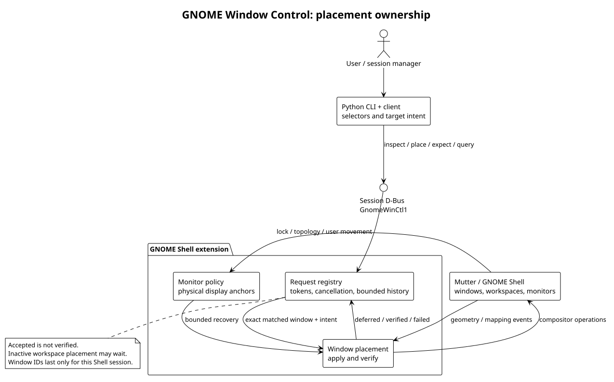

# Architecture

[Overview](../README.md) · [Usage](usage.md) · [PlantUML source](architecture.puml)

The Python CLI translates selectors and requested workspace, monitor, geometry,
and state into the versioned session-bus contract. The GNOME Shell extension is
the authority for compositor operations. It owns both explicit placement and
monitor recovery, so two independent components do not compete to move windows.

| Component | Responsibility | Source |
|---|---|---|
| Client | Parse requests, resolve target intent, call D-Bus, wait for verification | [`src/gnome_winctl`](../src/gnome_winctl) |
| Bus service | Expose capabilities, enumerate windows, dispatch requests | [`extension.js`](../extension/gnome-winctl-v3@sagecat.local/extension.js) |
| Request registry | Bind tokens to requests; reject stale callbacks; retain bounded results | [`placementRequests.js`](../extension/gnome-winctl-v3@sagecat.local/placementRequests.js) |
| Placement engine | Apply geometry and window state, handle deferred mapping, verify results | [`windowPlacement.js`](../extension/gnome-winctl-v3@sagecat.local/windowPlacement.js) |
| Monitor policy | Track physical display intent and recover after lock or topology changes | [`monitorPolicy.js`](../extension/gnome-winctl-v3@sagecat.local/monitorPolicy.js) |
| Public contract | Versioned methods and argument types | [D-Bus XML](../dbus/org.sagecat.GnomeWinCtl1.xml) |

A placement request is accepted with a stable token. It may be deferred until a
window can be mapped, applied through Mutter, and finally verified against actual
window state. `placed: true` means verified, not merely queued. Errors remain
associated with the same token. Deferred requests preserve physical monitor
intent and resolve it again after topology changes rather than reusing an old
monitor index.

Monitor recovery freezes anchors during lock and responds to topology changes
with debounced, bounded retries. Ambiguous or absent displays are left alone.
The extension does not activate workspaces to force completion. Supported native
user moves update intent; the monitor policy reports keybinding interception
limitations when the running Mutter API cannot safely transfer ownership.

The service does not launch applications or save their contents. Session managers
own those tasks and should wait for verified placement before reporting a fully
restored window. Window IDs, request tokens, and enable epochs belong to the
running Shell session, not a durable application identity.
